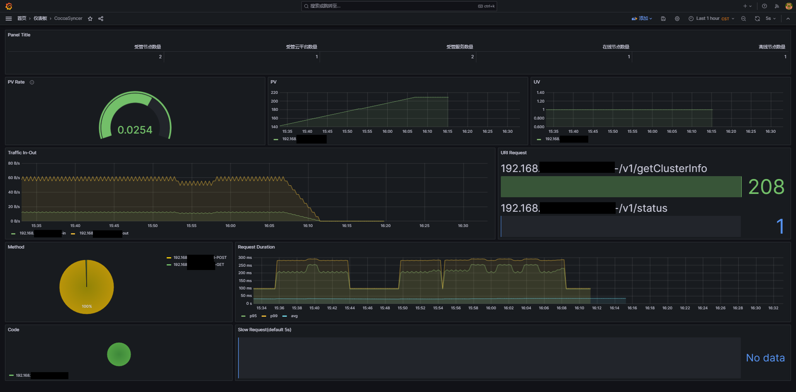

<hr/>

## 简介

这只超·可爱的心爱酱~ 提供了多节点（目前支持双节点）的 DDNS 分线路智能解析能力（目前支持阿里 DDNS），将一个域名被不同线路访问时引导至不同 IP 的服务器上，在节点故障时能自动将服务转移到正常工作的节点，适合有多条动态公网 IP 线路的用户对访问流量做 DNS 级别的分流，提升带宽利用率，改善用户访问速度，提升访问体验

支持线路：

- 默认（未命中其它所有规则的按照这里的值解析）
- 中国电信
- 中国联通
- 中国移动
- 中国教育网
- 海外

## 使用场景

在不同地点有多个动态公网 IP 线路的用户，希望能够将同一域名的流量分摊到不同线路上，举例如下：

有动态公网 IP 线路 `A=>电信` ，`B=>移动`，站点访问流量较大，单条线路的上传带宽难以满足访问需求，访问体验较差。希望将访问`www.example.com` 的电信和海外和其它线路的访客引导至电信线路，联通、移动和教育网线路的访客引导至移动线路。以此减轻单条线路的带宽压力和单个服务器的性能消耗

通常 DDNS 软件只能做到单节点单线路的 DDNS ，访问一个域名的所有流量都会到一个 IP 上面去，而 CocoaSyncer 就可以解决这个问题，同时提供了一定的高可用，当两个节点之一故障时，程序会自动切换会单节点模式，切换回正常工作的线路，如上面的例子，假如 B 移动线路所在地停电了，那么程序就会把 B 上面解析的服务全部切到 A 上，在 B 来电恢复正常之后，又会回到多节点解析模式，一定程度上防止了单点故障，所以我称之为“智能解析平台”

## 食用方法

### 下载

Release 下找 Pre-Release ， Pre-Release 的原因是目前暂时没有环境进行测试，测试环境试了是没有问题的，但是没上生产环境验证，后续完成验证后将发正式版

### 环境准备

- CocoaSyncer 需要一个数据库存储数据，由于使用了 xorm 做为数据库引擎，理论上支持多种数据库，在源码中我提供了 sqlite3 、postgres 和 mysql 三种数据库的驱动支持，但是目前仅测试了 mysql 数据库，其余数据库不保证兼容，感兴趣的话欢迎测试并反馈。因此，推荐准备一个 mysql 数据库，编码推荐 utf8mb4
- 填写目录下的 config.yaml ，参照文件内说明即可，把这个文件和 Release 放在一个文件夹里面
- 反代 or 开放 API 端口到外网，绑定一个域名给 CocoaSyncer （如果需要嵌入 Badge 信息，很可能你需要绑定两个域名）

### 本体( leader )

> 本体和分身都是同一个二进制文件，程序不分服务端和客户端，由 config 配置决定是本体还是分身

完成配置文件填写后执行 `./cocoaSyncer r`即可运行

### 分身( follower )

> 本体和分身都是同一个二进制文件，程序不分服务端和客户端，由 config 配置决定是本体还是分身

完成配置文件填写后执行 `./cocoaSyncer r`即可运行

### CLI

不带参数直接运行即可看到提示，命令可以用缩写执行，缩写是逗号后面那个，比如 `runProd` 可以简写为 `r`

```bash
NAME:
   CocoaSyncer - CocoaSyncer - 心爱酱多节点智能解析平台
                 Powered By Luckykeeper <luckykeeper@luckykeeper.site | https://luckykeeper.site>
                 ————————————————————————————————————————
                 注意：使用前需要先填写同目录下 config.yaml !

USAGE:
   CocoaSyncer [global options] command [command options] [arguments...]

VERSION:
   1.0.0_build20230918

COMMANDS:
   runProd, r                      启动 CocoaSyncer (生产环境)
   runDebug, rd                    启动 CocoaSyncer (调试)
   showStatus, status              输出当前运行状态
   updateCloudPlatformInfo, dns    更新云平台信息（更新 DNS API 账户）
   updateManagedServices, service  更新服务信息（要 DDNS 的域名）
   updateNodeInfo, node            更新节点信息(CocoaSyncer)
   help, h                         Shows a list of commands or help for one command

GLOBAL OPTIONS:
   --help, -h     show help
   --version, -v  print the version

COPYRIGHT:
   Luckykeeper <luckykeeper@luckykeeper.site | https://luckykeeper.site> | https://github.com/luckykeeper

```

### 基础配置

> 流程如下：启动->添加节点[node]->添加 DDNS （提供商）信息[dns]->添加服务[service]
>
> 请务必按照这个顺序执行

#### 启动

`./cocoaSyncer r` ，用 nohup / screen / systemd simple 服务挂在后台，做开机启动

#### 添加节点

另起一个终端

``./cocoaSyncer node` 添加节点，注意这个操作只能在 `leader` 侧执行， `follower` 侧无权执行此命令

#### 添加云服务商信息

`./cocoaSyncer dns` 添加云服务商信息，基本上是 AccessKey + AccessSecret 的形式，注意这个操作只能在 `leader` 侧执行， `follower` 侧无权执行此命令

#### 添加服务

`./cocoaSyner service` 添加你的服务（要 DDNS 的域名），注意这个操作只能在 `leader` 侧执行， `follower` 侧无权执行此命令

#### 展示

在终端执行 `./cocoaSyner status` 可以看详细的数据，在 web `/v1/status` 获取非敏感运行数据

如果需要在 web 展示访客正在使用那台服务器，可以贴上 `/v1/badge` 的 badge ，效果类似下面这样，右边会自动显示为节点友好名称，推荐不要超过 11 个英文字符


### 监控

`/metrics`是监控端口，你需要使用 Prometheus + Grafana 来进行监控和展示，乃至告警，这里提供 Prometheus 的模板和，Grafana 的仪表盘 json 文件 [./grafana/CocoaSyncer.json](./grafana/CocoaSyncer.json) ，仪表盘预览参考如下

<details> <summary>仪表盘预览 点击展开/收合图片</summary> 
    <center></center>
</details>

Prometheus yaml 文件模板

```bash
- job_name: "CocoaSyncer"

    static_configs:
      - targets: ["<IP>:<API 端口>"]
```

## 接口文档

doc 目录下 [./doc/接口文档.md](./doc/接口文档.md) 下给出了所有 HTTP 接口的文档，请自行查阅

## 小工具合集

### 优香酱小工具系列

- GitHub - luckykeeper/RESTCONF-YuukaChan: 优香酱华为 USG 系列设备北向管理小工具 | HayaseYuuka Huawei USG Series Device RESTCONF Management Tool
  https://github.com/luckykeeper/RESTCONF-YuukaChan
- GitHub - luckykeeper/YuukaChan-DPTECH: 优香酱迪普 FW 系列设备管理小工具 | HayaseYuuka DPTech FW Series Device Management Tool
  https://github.com/luckykeeper/YuukaChan-DPTECH
- GitHub - luckykeeper/YuukaDownloader: 优香酱系列小工具——快速解析初音站(yngal/fufugal)链接并送Aria2下载
  https://github.com/luckykeeper/YuukaDownloader
- GitHub - luckykeeper/YuukaChan-Ruijie-WS6xxx-Exporter: 优香酱系列小工具——锐捷AC WS6xxx 系列 Prometheus Exporter ，附带 Grafana 仪表盘模板 | HayaseYuuka Ruijie AC WS6xxx Series Prometheus Exporter With Grafana Template Included https://github.com/luckykeeper/YuukaChan-Ruijie-WS6xxx-Exporter

### 心爱酱小工具系列

- GitHub - luckykeeper/CocoaSyncer: 心爱酱多节点智能解析平台，实现多节点智能 DDNS 分线路解析 | Cocoa-Chan Smart Muti-Node DDNS Platform, Auto Update DNS Record With Muti-ISP-Line Supported https://github.com/luckykeeper/CocoaSyncer
- GitHub - luckykeeper/CocoaPush: 心爱酱钉钉消息推送机器人，让可爱的心爱酱帮你照看各个设备的运行状态 | Let Kawaii Cocoa-Chan to monitor device running status https://github.com/luckykeeper/CocoaSyncer

## 💈就要在这里立法典！

<details><summary>嘿嘿 心爱酱 嘿嘿</summary><p>对于拿着奶糖苹果的心爱酱，我的评价是四个字：好有感觉。我主要想注重于两点，来阐述我对于心爱酱的拙见：第一，我非常喜欢心爱酱。首先看心爱酱的立绘，心爱酱虽然看起来好好穿了学校制服，但是心爱酱好好地对制服做了一圈改造，整体都换成了心爱粉，看起来非常的搭，而且还在各个地方放上了点心做装饰，她不仅仅在裙子上系糖果，她还挂手串，手串还挂糖果，（真的好可爱），（倒吸一口凉气）我的妈呀，这已经到了仅仅是看一眼都能让人癫狂的程度，我就不多说了。第二，我非常喜欢粉毛。这是在很久很久之前，在认识心爱酱之前，完完全全的xp使然。心爱酱的粉毛长长的，软软的，香香的，吸起来非常的爽，真的好棒，好有感觉！然而心爱酱她不仅是粉毛，她还是粉长毛，她还系发带，她竟然还不好好系发带，她甚至在发带上挂巧克力。然而心爱酱的糖果只是装饰，她真的只是给你看一眼，哈哈。与其说心爱酱让我很有感觉，不如说心爱酱是为了我的xp量身定做的。抛开这一切因素，只看性格，心爱酱也是数一数二的好女孩：会做饭，会卖萌，活力十足，有时候又呆呆的，尤其是拿走她的奶糖苹果的时候，超可爱的~;心爱酱甚至还会变身和超进化，太酷辣！我好想和心爱一起养一只小心爱酱当女儿，所以想在这里问一下大家，要买怎样的枕头才能做这样的梦呢？心爱酱是越看越可爱的（流口水），不说了，我这就去做梦去！</p></details>

<p align="center"></p>

## 特别鸣谢

- https://github.com/denverdino/aliyungo
- https://github.com/honwen/golibs
